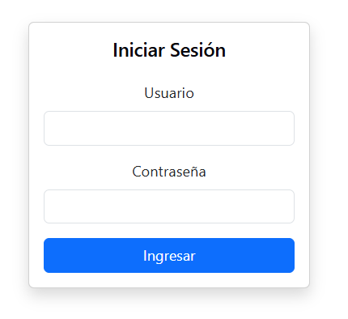
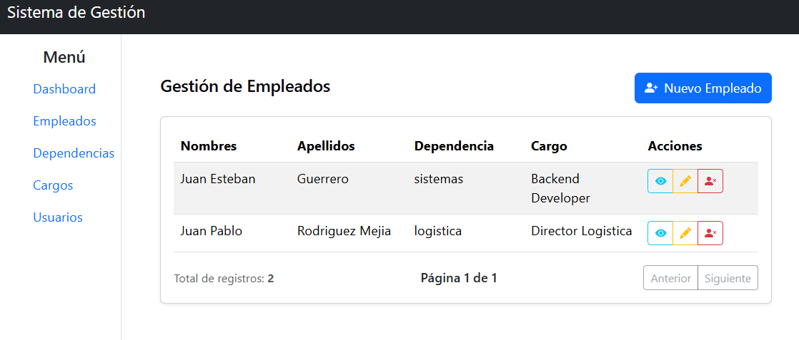

# Sistema de Gestión Empresarial - Frontend

Frontend de un Sistema de Gestión Empresarial desarrollado con React, Vite, Axios y Bootstrap. Permite la administración de usuarios, empleados, cargos y permisos mediante integración con una API REST construida en FastAPI, implementando autenticación JWT y control de acceso basado en roles.

## Tecnologías utilizadas

* React
* Vite
* React Router DOM
* Axios
* Bootstrap 5

## Funcionalidades implementadas

* Inicio de sesión con JWT
* Protección de rutas públicas y privadas
* Gestión de sesión mediante Local Storage
* Logout
* Integración con API REST FastAPI
* Gestión de usuarios
* Gestión de empleados
* Gestión de cargos
* Gestión de dependencias
* Paginación de resultados
* Control de acceso basado en roles (RBAC)
* Componentes reutilizables

## Capturas de pantalla

### Inicio de Sesión


### Gestión de Empleados


## Instalación

Clonar el repositorio:

```bash
git clone https://github.com/DanielTusarma/frontend_sistech.git
```

Instalar dependencias:

```bash
npm install
```

Crear archivo `.env`:

```env
VITE_API_URL=http://localhost:8000/api
```

Ejecutar el proyecto:

```bash
npm run dev
```

## Estructura del proyecto

```text
src/
├── api/
├── components/
├── pages/
├── routes/
├── services/
├── utils/
└── assets/
```

## Estado actual del proyecto

Proyecto en desarrollo.
Actualmente cuenta con autenticación JWT, gestión de empleados e integración completa con la API REST desarrollada en FastAPI.


## Próximas funcionalidades

- Gestión de usuarios
- Gestión de roles y permisos
- Dashboard administrativo
- Mejoras en experiencia de usuario
